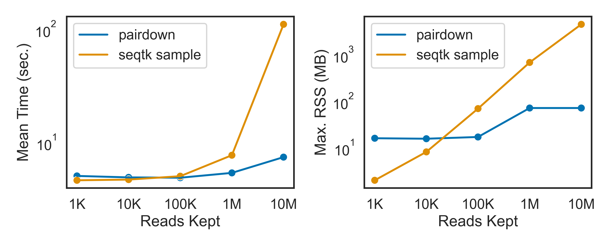

# pairdown
A CLI tool to downsample (pare down, get it?) **paired-end** FASTQs written in Rust.

I couldn't find one that preserved read pairing in two FASTQ files for some reason, though I'm sure one exists. If you do find one, don't tell me, otherwise I'll feel like I wasted my time doing this.

I just found out you can do the same thing with [`seqtk sample`](https://github.com/lh3/seqtk) if you use the same random seed for both FASTQs, but `pairdown` seems to be on par with, if not faster in most cases (see  [benchmarking results](https://github.com/quoctran98/pairdown?tab=readme-ov-file#benchmarking)).

## Installation

Make sure you have Rust installed, then run:

```
cargo install --git https://github.com/quoctran98/pairdown.git
```

## Usage

Run:

```
pairdown BC81_R1.fq BC81_R2.fq 1000000 -o ./downsampled/ -s 1
```

Output:

```
Downsampled 1000000 from 14887030 reads to ./downsampled/BC81_R1.fq and ./downsampled/BC81_R2.fq in 6 seconds.
```


This command takes in two paired-end FASTQ files (`BC81_R1.fq` and  `BC81_R2.fq`), randomly samples (without replacement, using a random seed `1`) 1,000,000 reads, then writes them to two output FASTQ files (`./downsampled/BC81_R1.fq` and  `./downsampled/BC81_R2.fq`).
## Options

```
-o, --prefix <PREFIX>  Output prefix (default: downsampled_<reads_kept>_)
-s, --seed <SEED>      Random seed (default: 17) [default: 17]
-v, --validate         Validate FASTQs (much slower, but ensures FASTQs are paired)
-h, --help             Print help
-V, --version          Print version
-
```

## Benchmarking

Benchmarking was done between `pairdown` (without input validation) and [`seqtk sample`](https://github.com/lh3/seqtk) (1-pass mode) on a 2021 MacBook Pro (M1 Pro, 16GB RAM) using two paired-end FASTQ files from a 150 cycle Illumina run (14,887,030 reads, 5.49GB each) and downsampling to various read counts (1K, 10K, 100K, 1M, 10M). Example commands for both shown below:

```
pairdown BC81_R1.fq BC81_R2.fq 10000000 -o ./temp/
```

```
seqtk sample -s100 BC81_R1.fq 10000000 > ./temp/BC81_R1.fq
seqtk sample -s100 BC81_R2.fq 10000000 > ./temp/BC81_R2.fq
```

Time benchmarks were collected with [`hyperfine`](https://github.com/sharkdp/hyperfine) (with 3 warmup runs) and memory benchmarks were manually collected with `/usr/bin/time -l`. Results are avilable in the [`/bench/`] directory. Commands wrote to a temporary directory which was deleted after each run instead of writing to `/dev/null` to capture I/O overhead.


